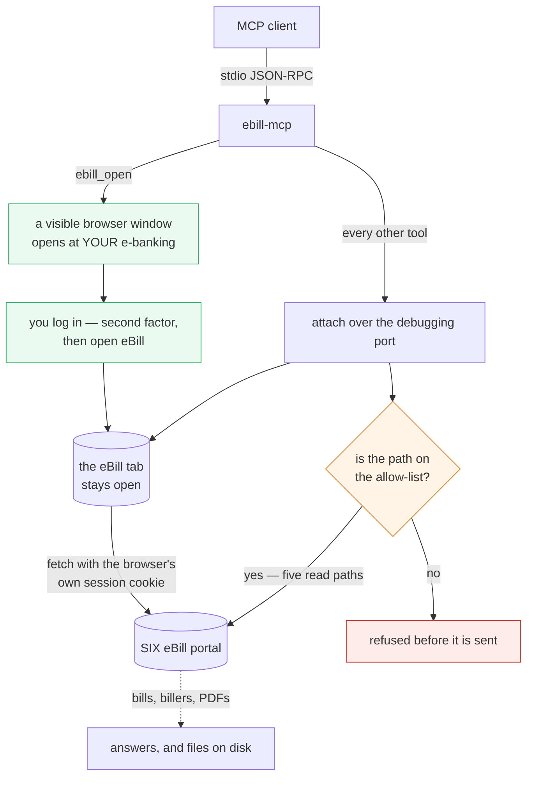

<div align="center">

# ebill-mcp

Read your Swiss **eBill** archive and download the invoice PDFs. Read-only — it cannot approve, release or pay anything.

[](https://www.npmjs.com/package/ebill-mcp)
&nbsp;
[](https://github.com/sapn95/ebill-mcp/actions/workflows/ci.yml)
&nbsp;
[](https://nodejs.org)
&nbsp;
[](LICENSE)

</div>

---

> **Unofficial, and attached to your bank.** eBill is reached only through an
> authenticated e-banking session, so this server reads through a window **you**
> logged into. It is read-only by construction — see *What it cannot do* — but it
> is still pointed at a payment system, and it is inherently fragile: the portal
> is an Angular app that changes without notice. Use it for **your own** account
> and respect the provider's terms of service.

An [MCP](https://modelcontextprotocol.io) server for the Swiss **eBill** portal
operated by SIX. From any MCP client (Claude Code, Claude Desktop, …) you can
list the bills in your archive — biller, amount, due date, delivery date — and
download the invoice PDFs.

## There is no credential to hold

That is the fact everything else follows from. eBill has no API you can get a
key for; the portal is entered by SSO redirect from your bank's e-banking, and
the login is second-factor-bound. So a run cannot start without a human.

**You log in. The server reads.** It opens a visible browser window at your
e-banking and hands it to you; it never types into that window. Afterwards it
attaches to the same window over the debugging port and reads through the
session you established. One login serves many calls — disconnecting a debug
client leaves the window standing, which is the whole reason this is usable.



No token ever reaches this process. The session lives in the browser and the
browser applies it, so there is nothing here to leak — and nothing to store.

## What it cannot do

Approving a bill, releasing one for payment, editing an amount, adding a biller
subscription and cancelling a standing approval are all one call away in the
same API, and one click away in the same page. "We only wrote reads" is a
property of today's code, so it is enforced twice:

1. **Every request goes through one function that takes no method and no body.**
   There is no code path in this server that can send anything but a `GET`.
2. **Every path is matched against an allow-list first.** Five patterns, all
   reads. Nothing that changes state is on it, so reaching one takes editing the
   source rather than passing an argument.

Both are tested, and the fixture answers `405` to anything but a `GET` — so the
assertion "only reads arrived" cannot pass for the wrong reason.

## Prerequisites

- **Node.js ≥ 20.19**
- A Chromium for Playwright, and ideally a real Chrome to log in with
- Swiss e-banking with eBill enabled

```bash
git clone https://github.com/sapn95/ebill-mcp.git
cd ebill-mcp
npm install
npx playwright install chromium
```

## Register in Claude Code

```bash
claude mcp add ebill --scope user -- node /absolute/path/to/ebill-mcp/index.js
```

Set your bank's entry page once, so `ebill_open` does not have to be told every
time — this server does not guess which bank you use:

```bash
export EBILL_BANK_URL=https://your-bank.example.com/login
```

## The normal flow

1. `ebill_open` — a window opens at your e-banking. **You** log in and open eBill.
2. `ebill_status` — confirms the session is reachable and says how long it has left.
3. `ebill_list_bills`, `ebill_download_all`, … for as long as the session lasts.
4. When it expires, every tool says so and names the fix: log in again.

## Tools

| Tool | Arguments |
| --- | --- |
| `ebill_status` | — |
| `ebill_open` | `url` (optional; defaults to `EBILL_BANK_URL`) |
| `ebill_settings` | — |
| `ebill_list_bills` | `status` (`open` \| `done` \| `all`), `limit` |
| `ebill_get_bill` | `bill_id` |
| `ebill_billers` | — |
| `ebill_download_bill` | `bill_id`, `output_path` (absolute) |
| `ebill_download_all` | `output_dir` (absolute), `status` |

## Environment variables

| Variable | Default | Purpose |
| --- | --- | --- |
| `EBILL_BASE_URL` | `https://ebill-portal.six-group.com` | portal origin |
| `EBILL_CDP` | `http://localhost:9222` | where the logged-in window listens |
| `EBILL_PROFILE` | `~/.ebill-mcp/profile` | browser profile — **holds a live banking session** |
| `EBILL_BANK_URL` | unset | your e-banking entry page for `ebill_open` |
| `EBILL_BROWSER` | `chrome` | channel or absolute path |
| `EBILL_DEBUG` | unset | `1` traces every path read, on stderr |

A variable that is **set**, even to the empty string, is authoritative: an empty
`EBILL_BANK_URL` means *there is no bank here*, not "fall back to the default".
Anything else would make "no bank" impossible to express, and would let a test
that thought it was isolated open a real login page.

> **Security:** the profile directory holds a **live e-banking session**. It is a
> secret, it is git-ignored, and it belongs outside any repository. Delete it
> when a run is done.

## Three things the portal does that cost a day to find out

**A 200 is not evidence.** The Angular server answers *any* unknown path under
its own prefix with the app shell and a `200 application/json`. The four obvious
guesses at a PDF endpoint — `payments/{id}/receipt`, `/document`, `/bill`,
`/pdf` — all "work" if you read status codes. None of them exists. Every
download here is checked by its first bytes instead.

**The PDF is not under `/api/`.** It is
`/ebill-portal/ui/payment-pdfs/<businessCaseId>/<receiptFileName>`, and the
filename out of the record is part of the path — URL-encoded, not derivable, not
optional. Records without a filename have no document, and are reported as such
rather than given a synthesised name.

**One status is half an archive.** The bills live under two, `done` and `open`,
and the default view shows one of them. `ebill_list_bills` reads both unless you
narrow it on purpose.

Also worth knowing: `businessCaseDate` is the date eBill *delivered* the bill,
which is days to weeks away from the date printed on the document. If you are
filing these, the printed date is usually the one you want.

## Checks

```bash
npm run gate      # lint + smoke + hygiene + tests with coverage enforced
npm test          # just the tests
npm run mutate    # mutation-test the lines this branch changed
```

Runs offline and without a bank: the suites attach to a throwaway Chromium
holding a local fixture, so nothing they do can reach a real account.

The fixture is the interesting part. It answers the app shell with a `200` for
unknown paths exactly as the portal does — a fixture that returned `404` there
would make the guard against it untestable — and it refuses anything that is not
a `GET`, so the test asserting that only reads left this process means something.

### Mutation testing

`npm run mutate` asks a different question: not "do the tests pass" but "would
they notice if a guard were removed". StrykerJS deletes one piece of behaviour
at a time and reruns the suite; whatever survives is something no assertion is
watching. It found eleven real gaps in the sibling
[pingen-mcp](https://github.com/sapn95/pingen-mcp) after model review rounds had
stopped turning anything up. Here it runs over the lines a branch changed,
because this suite launches a real browser and a full pass costs hours.

## License

MIT © sapn95 — see [LICENSE](LICENSE).
